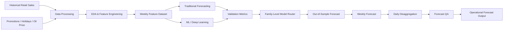
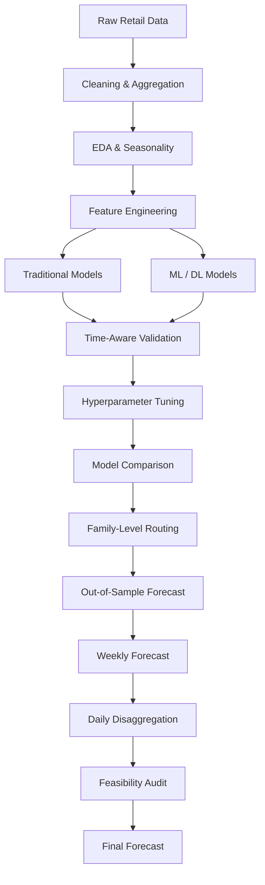
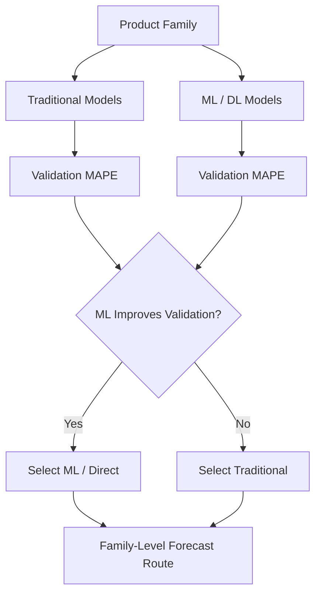
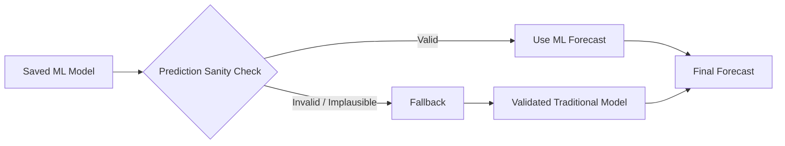
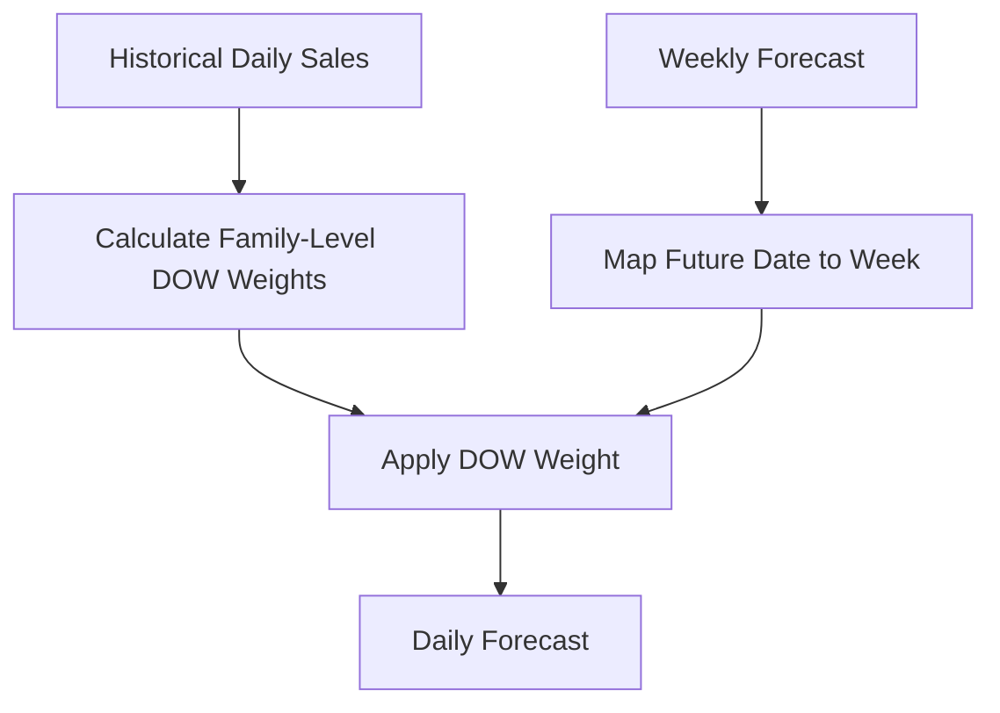
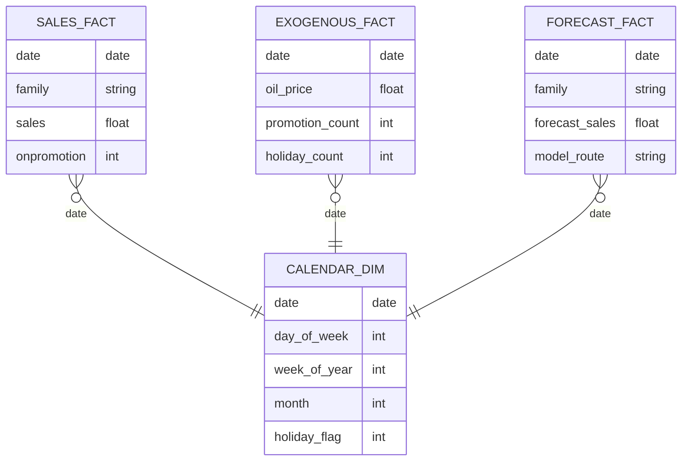

# 📦 StockSense AI — Intelligent Inventory Demand Forecasting

<p align="center">
  <a href="https://github.com/abhi-iitg/stocksense-ai"></a>
  <a href="https://abhishek-kg-portfolio-pied.vercel.app/"></a>
  <a href="https://www.linkedin.com/in/abhishekkumargond/"></a>
  <a href="mailto:mr.abhishekaa@gmail.com"></a>
</p>

<p align="center">
  <b>Retail Demand Forecasting • Time-Series Analytics • Machine Learning • Deep Learning • Inventory Analytics</b>
</p>

<p align="center">
  An end-to-end forecasting system that compares statistical, machine-learning and deep-learning approaches,
  selects forecasting strategies at the product-family level, and converts weekly demand forecasts into
  operational daily estimates.
</p>

---

## 📌 Table of Contents

- [🎯 Executive Summary](#-executive-summary)
- [💼 Business Problem](#-business-problem)
- [💡 Solution](#-solution)
- [📊 Project Highlights](#-project-highlights)
- [🗺️ System Architecture](#️-system-architecture)
- [🔄 End-to-End Pipeline](#-end-to-end-pipeline)
- [📚 Dataset & Forecasting Scope](#-dataset--forecasting-scope)
- [⚙️ Feature Engineering](#️-feature-engineering)
- [🧪 Forecasting Methodology](#-forecasting-methodology)
- [🤖 Models Evaluated](#-models-evaluated)
- [🎯 Model Selection & Hybrid Routing](#-model-selection--hybrid-routing)
- [📈 Validation Results](#-validation-results)
- [📅 Out-of-Sample Forecasting](#-out-of-sample-forecasting)
- [📐 Weekly-to-Daily Disaggregation](#-weekly-to-daily-disaggregation)
- [🔍 Forecast Validation & QA](#-forecast-validation--qa)
- [📊 Forecast Visualization](#-forecast-visualization)
- [📊 Power BI Dashboard Design](#-power-bi-dashboard-design)
- [💡 Business Insights](#-business-insights)
- [⚠️ Engineering Decisions & Lessons](#️-engineering-decisions--lessons)
- [📁 Project Structure](#-project-structure)
- [🛠️ Tech Stack](#️-tech-stack)
- [🚀 Getting Started](#-getting-started)
- [📚 Notebook Guide](#-notebook-guide)
- [🔮 Future Improvements](#-future-improvements)
- [🎯 Recruiter Snapshot](#-recruiter-snapshot)
- [👨‍💻 Author](#-author)
- [📬 Contact](#-contact)

---

## 🎯 Executive Summary

**StockSense AI** addresses a practical retail planning problem:

> **How can future product demand be forecast accurately enough to support better inventory and operational decisions?**

Instead of assuming that one forecasting algorithm is best for every category, the project evaluates multiple forecasting families and uses **validation evidence to determine the preferred route for each product family**.

The workflow covers:

**Data Preparation → EDA → Feature Engineering → Statistical Forecasting → ML/DL Modeling → Hyperparameter Tuning → Model Comparison → Family-Level Routing → Out-of-Sample Forecasting → Daily Disaggregation → Feasibility Audit**

The result is a decision-oriented forecasting pipeline rather than a single-model experiment.

---

## 💼 Business Problem

Retailers face two fundamental inventory risks:

| Forecasting Problem | Business Consequence |
|---|---|
| Under-forecasting | Stockouts, lost sales and poor customer experience |
| Over-forecasting | Excess inventory and higher holding costs |
| Ignoring seasonality | Repeated forecast errors around recurring demand patterns |
| One-model-fits-all forecasting | Weak performance across heterogeneous categories |
| Ignoring promotions/exogenous variables | Missed demand changes and spikes |
| Weekly-only forecasting | Difficult translation into daily operational planning |

### Core Design Principle

> **Choose the forecasting strategy based on evidence, not algorithm popularity.**

---

## 💡 Solution

StockSense AI combines multiple forecasting paradigms into one evaluation and forecasting workflow.

### Core capabilities

- 📊 Retail demand aggregation and exploratory analysis
- 📅 Time-aware feature engineering
- 🔁 Lag and rolling-window features
- 🌀 Calendar and cyclical features
- 🎉 Holiday-sensitive forecasting
- 📣 Promotion-aware forecasting
- 🛢️ Exogenous-variable integration
- 📈 Classical statistical forecasting
- 🤖 Tree-based machine learning
- 🧠 Dense neural networks and LSTM
- 🎯 Direct multi-step forecasting
- 🔄 Recursive forecasting
- ⚙️ Hyperparameter tuning
- 🧩 Product-family-level model routing
- 📆 Weekly-to-daily forecast disaggregation
- 🔍 Out-of-sample forecasting
- 🧪 Multi-layer forecast sanity checks
- 🛡️ Model-health fallback logic

---

## 📊 Project Highlights

| Dimension | Implementation |
|---|---|
| Forecasting domain | Retail / Store Sales |
| Forecasting granularity | Product-family level |
| Product families | 10 |
| Forecast horizon | Multi-step / approximately 4-week framework |
| Traditional models | Naive, Seasonal Naive, Holt-Winters, ARIMA, SARIMA, SARIMAX |
| ML models | Decision Tree, Random Forest, XGBoost |
| Deep Learning | Dense Neural Network, LSTM |
| Forecasting strategies | Recursive + Direct |
| Key features | Lags, rolling statistics, calendar, holidays, promotions, oil-price signals |
| Model selection | Validation-driven family-level routing |
| Final test window | 16-day out-of-sample period |
| Daily output | Day-of-week weighted disaggregation |
| QA | Continuity, decomposition, YoY and exogenous-signal checks |

---

## 🗺️ System Architecture



---

## 🔄 End-to-End Pipeline



---

## 📚 Dataset & Forecasting Scope

The project is based on the **Favorita Store Sales** forecasting problem in Ecuador.

The forecasting system operates across 10 major product families:

1. BEVERAGES
2. BREAD/BAKERY
3. CLEANING
4. DAIRY
5. DELI
6. GROCERY I
7. MEATS
8. PERSONAL CARE
9. POULTRY
10. PRODUCE

The modeling workflow aggregates demand to a family-level time series and combines historical demand behavior with known future signals.

---

## ⚙️ Feature Engineering

### 1. Lag Features

Historical demand is represented through multiple lag windows:

```text
lag_1
lag_2
lag_3
...
lag_52
```

The longer seasonal lags help capture recurring annual retail patterns.

### 2. Rolling Statistics

```text
rolling_mean
rolling_std
rolling_min
rolling_max
```

These features represent local demand level and volatility.

### 3. Calendar Features

- Day of week
- Week of year
- Month
- Year
- Holiday indicators
- Cyclical encodings

### 4. Exogenous Variables

The pipeline also uses known signals including:

- Promotions
- Holiday counts
- Oil-price-related variables

This allows the forecasting models to use information beyond historical sales alone.

---

## 🧪 Forecasting Methodology

### Stage 1 — Traditional Forecasting

The statistical benchmark evaluates:

- Naive
- Seasonal Naive
- Holt-Winters Exponential Smoothing
- ARIMA
- SARIMA
- SARIMAX

The best traditional model is selected independently for each product family using validation performance.

### Stage 2 — Machine Learning

The nonlinear layer evaluates:

- Decision Tree Regressor
- Random Forest Regressor
- XGBoost

### Stage 3 — Deep Learning

The project also evaluates:

- Dense Neural Network
- LSTM

### Stage 4 — Multi-Step Forecasting

Two approaches were investigated:

**Recursive**

```text
t+1
 ↓
prediction becomes future input
 ↓
t+2
 ↓
prediction becomes future input
 ↓
...
```

**Direct**

```text
Model 1 → t+1
Model 2 → t+2
Model 3 → t+3
Model 4 → t+4
```

Direct forecasting reduces repeated error propagation across future steps.

---

## 🤖 Models Evaluated

| Category | Models |
|---|---|
| Baseline | Naive, Seasonal Naive |
| Statistical | Holt-Winters, ARIMA, SARIMA, SARIMAX |
| Machine Learning | Decision Tree, Random Forest, XGBoost |
| Deep Learning | Dense Neural Network, LSTM |

The project intentionally keeps both simple and complex models because **model complexity should be justified by validation performance**.

---

## 🎯 Model Selection & Hybrid Routing

The key product-level decision is not:

> "Which model is globally best?"

It is:

> **"Which model is best for this product family?"**

### Routing rule

```text
IF ML validation improvement >= 0%
    → Select ML / Direct route
ELSE
    → Select Traditional statistical route
```

The improvement metric is:

$$
MAPE\_Better\_\% =
\frac{MAPE_{Trad} - MAPE_{ML}}
{MAPE_{Trad}}
\times 100
$$

### Routing Architecture



---

## 📈 Validation Results

The validation results demonstrate that **different product families benefit from different modeling strategies**.

| Product Family | Traditional MAPE | ML MAPE | Improvement | Validation Route |
|---|---:|---:|---:|---|
| BEVERAGES | 11.14% | 6.02% | **+45.99%** | ML — Direct |
| BREAD/BAKERY | 5.42% | 6.95% | -28.19% | Traditional — SARIMAX |
| CLEANING | 7.44% | 5.95% | **+20.13%** | ML — Direct |
| DAIRY | 19.39% | 6.28% | **+67.60%** | ML — Direct |
| DELI | 6.28% | 7.84% | -24.96% | Traditional — SARIMAX |
| GROCERY I | 7.64% | 2.76% | **+63.83%** | ML — Direct |
| MEATS | 8.21% | 6.99% | **+14.88%** | ML — Direct |
| PERSONAL CARE | 9.94% | 10.30% | -3.70% | Traditional — SARIMAX |
| POULTRY | 7.62% | 7.20% | **+5.47%** | ML — Direct |
| PRODUCE | 852.23% | 455.16% | **+46.59%** | ML — Direct |

### Strongest observed improvements

- **DAIRY:** +67.60%
- **GROCERY I:** +63.83%
- **PRODUCE:** +46.59%
- **BEVERAGES:** +45.99%
- **CLEANING:** +20.13%

> **Important:** PRODUCE has a very large baseline MAPE, so its percentage improvement should be interpreted alongside absolute error behavior rather than treated as the strongest practical forecast solely because the percentage is large.

---

## 📅 Out-of-Sample Forecasting

The final forecast stage uses a **16-day out-of-sample period from August 16–31, 2017**.

Because future sales values are unavailable at inference time, future lag and rolling values cannot simply be calculated from actual future demand.

The inference pipeline therefore combines:

```text
Last Known Historical Features
        +
Known Future Exogenous Features
        ↓
Forecast Generation
```

### Model-health fallback

During final inference, saved XGBoost artifacts produced implausibly low predictions. Instead of allowing unreliable outputs into the final forecast, the pipeline used a controlled fallback to validated traditional models.



For the final out-of-sample run, **100% of the product families were routed through validated traditional forecasting models** rather than using the unreliable saved ML artifacts.

This is a deliberate reliability decision:

> **A validated model with stable behavior is preferable to a more complex model producing unreliable predictions.**

---

## 📐 Weekly-to-Daily Disaggregation

The model generates weekly demand forecasts, while inventory operations often require daily estimates.

Simply dividing weekly demand by 7 assumes uniform demand across all days.

StockSense AI instead calculates historical day-of-week weights for each product family.

### Formula

$$
Weight_{family,dow}
=
\frac{
\sum Sales_{family,dow}
}{
\sum Sales_{family,all\ days}
}
$$

Then:

$$
DailyForecast_{family,t}
=
WeeklyForecast_{family,week}
\times
Weight_{family,dow(t)}
$$

### Process



The final daily predictions are saved to:

```text
results/test_predictions_daily_edit_3.csv
```

---

## 🔍 Forecast Validation & QA

Forecast evaluation goes beyond a single MAPE number.

### 1. Visual Continuity Check

Checks for:

- Sudden jumps
- Discontinuities
- Unrealistic trend changes
- Structural breaks

### 2. Seasonal Decomposition

The combined actual + forecast timeline is examined for:

- Trend
- Seasonality
- Residual behavior

### 3. Year-over-Year Benchmarking

The August 16–31, 2017 forecast is benchmarked against the same period in 2016.

### 4. Exogenous Signal Audit

Forecast behavior is examined against:

- Promotion activity
- Oil-price movements
- Calendar effects

The objective is to identify forecasts that behave inconsistently with known business drivers.

---

## 📊 Forecast Visualization

The project generates a daily forecast visualization covering the forecasted product families.

### Actual Project Output

If the repository preserves the original result directory, the generated chart is available at:

```text
Demand Forecasting System/
└── results/
    └── dashboard_plots/
        └── forecasted_daily_sales_edit_3.png
```

### GitHub Image Display

For a cleaner README, copy that generated PNG to:

```text
docs/images/forecasted_daily_sales.png
```

Then use:

```markdown

```

### Recommended GitHub Visual Structure

```text
docs/
├── images/
│   ├── forecasted_daily_sales.png
│   ├── model_comparison.png
│   ├── forecast_validation.png
│   └── powerbi_dashboard.png
└── diagrams/
    ├── system_architecture.png
    └── forecasting_pipeline.png
```

**Do not add placeholder screenshots.** Only add files that are actually generated by the project.

---

## 📊 Power BI Dashboard Design

The forecasting outputs are structured so they can be consumed by a business-facing dashboard.

### Recommended Executive Dashboard

```text
┌─────────────────────────────────────────────────────────────┐
│                 STOCKSENSE AI — INVENTORY                  │
│                     DEMAND FORECAST                        │
├──────────────┬──────────────┬──────────────┬───────────────┤
│ Product      │ Forecast     │ Forecast     │ Model Route   │
│ Families     │ Horizon      │ Granularity  │ ML / SARIMAX  │
│     10       │ 16 Days      │ Daily        │ Hybrid        │
├──────────────┴──────────────┴──────────────┴───────────────┤
│                                                             │
│             DAILY FORECAST TREND                            │
│                                                             │
├───────────────────────────────┬─────────────────────────────┤
│ FAMILY PERFORMANCE            │ MODEL ROUTING               │
│                               │                             │
│ BEVERAGES                     │ ML — Direct                │
│ DAIRY                         │ ML — Direct                │
│ GROCERY I                     │ ML — Direct                │
│ BREAD/BAKERY                  │ SARIMAX                     │
│ DELI                          │ SARIMAX                     │
├───────────────────────────────┴─────────────────────────────┤
│ Promotions • Holidays • Oil Price • YoY Benchmark           │
└─────────────────────────────────────────────────────────────┘
```

### Suggested Power BI Pages

**Page 1 — Executive Overview**

- Forecasted demand
- Forecast horizon
- Product-family selector
- Model route
- Daily trend

**Page 2 — Model Performance**

- Traditional vs ML MAPE
- Improvement %
- Selected model by family

**Page 3 — Demand Drivers**

- Promotions
- Holidays
- Oil price
- Calendar effects

**Page 4 — Forecast QA**

- Historical vs forecast continuity
- YoY comparison
- Seasonal decomposition
- Forecast anomaly checks

### Suggested Data Model



> **Note:** This README documents the Power BI dashboard as a recommended business-consumption layer. Unless a Power BI `.pbix` file or actual dashboard screenshot is included in the repository, it should not be presented as an already-deployed Power BI dashboard.

---

## 💡 Business Insights

### 1. There is no universal forecasting winner

The best model varies by product family.

**Business implication:** forecasting systems should support category-specific model selection.

### 2. Model complexity must earn its place

ML produced meaningful improvements for several families, while traditional SARIMAX remained better for others.

**Business implication:** sophisticated models should be retained when they create measurable validation value.

### 3. Forecast quality is more than MAPE

A statistically strong forecast can still be operationally implausible.

That is why the system adds continuity, decomposition, YoY and exogenous-signal checks.

### 4. Reliability matters

The final inference stage detected unreliable saved ML artifacts and safely fell back to validated traditional models.

**Business implication:** production forecasting systems need model-health checks and fail-safe behavior.

### 5. Weekly forecasts must become operational forecasts

The day-of-week weighting engine converts:

**Forecast Model → Weekly Demand → Daily Operational Forecast**

This makes the output more useful for inventory planning.

---

## ⚠️ Engineering Decisions & Lessons

### Why not use only deep learning?

Because more complex does not automatically mean more accurate.

Traditional forecasting can outperform ML when demand patterns are strongly seasonal or structurally predictable.

### Why family-level routing?

Different categories have different:

- Seasonality
- Volatility
- Demand scale
- Promotion sensitivity
- Autocorrelation
- Nonlinear behavior

A family-level router allows the forecasting strategy to adapt.

### Why include a fallback?

Forecasting systems should fail safely.

If a model artifact or prediction behaves abnormally, the system should prefer a validated alternative rather than silently publishing unreliable results.

### Why time-aware validation?

Random train/test splitting can introduce future information into training.

Chronological validation better represents how the model will behave in real forecasting conditions.

---

## 📁 Project Structure

```text
StockSense-AI/
│
├── README.md
├── requirements.txt
│
├── Demand Forecasting System/
│   │
│   ├── data/
│   │   ├── final_train_df.csv
│   │   ├── final_test_df.csv
│   │   ├── weekly_features.csv
│   │   ├── inventory_features.csv
│   │   └── segmentation_features.csv
│   │
│   ├── models/
│   │   ├── traditional_model_implementation.ipynb
│   │   ├── ml_dl_model_implementation.ipynb
│   │   ├── best_models_per_family.csv
│   │   ├── default_ml_dl_model_performance.csv
│   │   ├── tuned_ml_dl_model_performance.csv
│   │   ├── production_models/
│   │   └── production_traditional_models/
│   │
│   ├── results/
│   │   ├── final_model.ipynb
│   │   ├── forecast_on_test_data.ipynb
│   │   ├── feasibility_evaluation.ipynb
│   │   ├── ml_trad_model_comparison.csv
│   │   ├── hybrid_fitted_values.csv
│   │   ├── test_predictions_weekly_edit_3.csv
│   │   ├── test_predictions_daily_edit_3.csv
│   │   └── dashboard_plots/
│   │       └── forecasted_daily_sales_edit_3.png
│   │
│   ├── processing.ipynb
│   ├── Store_Sales_Forecasting_Summary.md
│   └── test_forecasting_implementation_plan.md
│
└── docs/
    └── images/
```

---

## 🛠️ Tech Stack

### Programming & Data


- Python
- Pandas
- NumPy
- SciPy

### Statistical Forecasting

- Statsmodels
- ARIMA
- SARIMA
- SARIMAX
- Holt-Winters
- Seasonal Naive

### Machine Learning


- Scikit-learn
- Decision Trees
- Random Forest
- XGBoost
- TimeSeriesSplit
- Grid Search / Randomized Search

### Deep Learning

- TensorFlow / Keras
- PyTorch
- LSTM
- Dense Neural Networks

### Visualization & Analysis

- Matplotlib
- Seaborn
- Jupyter Notebook

---

## 🚀 Getting Started

### Prerequisites

Recommended:

```text
Python 3.10+
Jupyter Notebook / JupyterLab
pip or conda
```

### 1. Clone the Repository

```bash
git clone https://github.com/abhi-iitg/stocksense-ai.git
cd stocksense-ai
```

### 2. Create Environment

#### Conda

```bash
conda create -n stocksense python=3.10
conda activate stocksense
```

#### Or venv

```bash
python -m venv venv
```

Windows:

```bash
venv\Scripts\activate
```

macOS/Linux:

```bash
source venv/bin/activate
```

### 3. Install Dependencies

```bash
pip install -r requirements.txt
```

### 4. Launch Jupyter

```bash
jupyter notebook
```

### 5. Recommended Execution Order

```text
1. processing.ipynb
2. traditional_model_implementation.ipynb
3. ml_dl_model_implementation.ipynb
4. final_model.ipynb
5. forecast_on_test_data.ipynb
6. feasibility_evaluation.ipynb
```

---

## 📚 Notebook Guide

| Notebook | Purpose |
|---|---|
| `processing.ipynb` | Data preprocessing, aggregation and feature engineering |
| `traditional_model_implementation.ipynb` | Statistical forecasting and traditional model selection |
| `ml_dl_model_implementation.ipynb` | ML/DL modeling, tuning and direct/recursive forecasting |
| `final_model.ipynb` | Traditional vs ML comparison and family-level routing |
| `forecast_on_test_data.ipynb` | Out-of-sample forecasting and final prediction generation |
| `feasibility_evaluation.ipynb` | Forecast sanity checks and visual validation |

---

## 🔮 Future Improvements

- [ ] Probabilistic forecasts
- [ ] Prediction intervals
- [ ] Quantile regression
- [ ] Cost-sensitive inventory optimization
- [ ] Safety-stock recommendations
- [ ] Reorder-point optimization
- [ ] Stockout-risk scoring
- [ ] Service-level optimization
- [ ] Promotion uplift modeling
- [ ] Hierarchical store → family → SKU forecasting
- [ ] Automated retraining
- [ ] Model drift detection
- [ ] Champion/challenger model monitoring
- [ ] REST API for forecasting
- [ ] Interactive Streamlit dashboard
- [ ] Power BI production dashboard
- [ ] Cloud deployment

---

## 🎯 Recruiter Snapshot

| Recruiter Signal | Evidence |
|---|---|
| Time-Series Analytics | ARIMA, SARIMA, SARIMAX, Holt-Winters |
| Machine Learning | Decision Tree, Random Forest, XGBoost |
| Deep Learning | Dense NN, LSTM |
| Feature Engineering | Lags, rolling, calendar, cyclical, exogenous |
| Model Evaluation | MAPE, MAE, RMSE |
| Model Selection | Family-level validation-driven routing |
| Forecast Strategy | Direct + recursive multi-step forecasting |
| Hyperparameter Optimization | Dynamic boundary-shifting search |
| Reliability Engineering | Model-health checks + fallback |
| Forecast QA | Continuity, decomposition, YoY, exogenous audits |
| Business Thinking | Weekly-to-daily operational forecasting |
| Decision Making | Evidence-based model selection |

### Placement-Relevant Skills

This project demonstrates capabilities relevant to:

- Data Science
- Data Analytics
- Business Analytics
- Supply Chain Analytics
- Forecasting
- Retail Analytics
- Decision Science
- Operations Analytics
- Machine Learning

---

## 👨‍💻 Author

### Abhishek Kumar Gond

**B.Tech — Chemical Engineering | IIT Guwahati | 2023–2027**

Focused on practical applications of:

**Data Science • Machine Learning • Analytics • Forecasting • Business Decision-Making**

<p align="center">
  <a href="https://github.com/abhi-iitg">
    
  </a>
  <a href="https://abhishek-kg-portfolio-pied.vercel.app/">
    
  </a>
</p>

---

## 📬 Contact
Abhishek Kumar Gond
IITG

---

## ⭐ Project Positioning

> **StockSense AI is an end-to-end retail demand forecasting system that compares statistical, machine-learning and deep-learning approaches, selects forecasting strategies at the product-family level using validation evidence, converts weekly forecasts into daily operational demand, and applies model-health and feasibility checks before producing final outputs.**

### Core Engineering Principle

**Forecast → Validate → Route → Audit → Operationalize**

---

<p align="center">
  <b>Built with Python • Time-Series Analytics • Machine Learning • Deep Learning • Forecasting</b>
</p>
